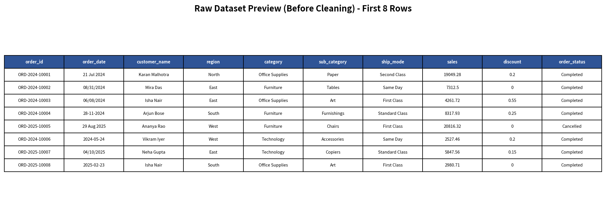

# Sales Data Cleaning & Analysis Project

**Project Duration:** June 2026  
**Status:** Completed & Documented

---

## Problem Summary

The raw sales dataset contained multiple data quality issues that made reliable reporting difficult:

- Inconsistent text formatting (mixed case, extra spaces, variant spellings)
- Non-standardized and mixed date formats
- Duplicate records (both exact copies and conflicting duplicates)
- Problematic discount values (missing, negative, and string percentages like "70%")
- Inconsistent order and payment statuses affecting sales calculations

**Objective:** Clean the dataset, apply defined business rules, create calculated fields, and produce actionable pivot summaries while maintaining full auditability.

---

## Dataset Description

- **Source:** `raw_orders.xlsx`
- **Records:** 932 rows with 21 original columns
- **Domain:** Retail / E-commerce sales transactions (India-focused)
- **Time Period:** January 2024 – October 2025
- **Key Fields:** `order_id`, `order_date`, `ship_date`, customer details, product category/sub-category, pricing, discount, shipping, and order status

---

## Tools Used

- **Python 3.12**
  - `pandas`: Data cleaning, transformation, and pivot creation
  - `openpyxl`: Professional Excel file generation with formatting
  - `matplotlib`: Screenshot generation
- **LibreOffice** (via automation): Formula recalculation

---

## Cleaning Steps Performed

### Text Field Standardization (Tasks 1–2)
- Applied trimming, whitespace normalization, and Title Case conversion
- Standardized: `customer_name`, `segment`, `region`, `category`, `sub_category`, `ship_mode`, `payment_status`, `order_status`
- Filled missing `region` and `ship_mode` with **"Unknown"** and flagged them

### Date Cleaning & Validation (Task 3)
- Implemented robust multi-format date parsing
- Created clean datetime columns
- Added `shipping_delay_days` and `is_invalid_shipping` flag
- Flagged **91 records** where ship date preceded order date

### Duplicate Management (Task 4)
- Removed **20 exact duplicate rows**
- Identified **12 conflicting order_id groups** (24 rows)
- **Kept** conflicting records and clearly flagged them for review

### Business Rules Application (Task 5)
- Applied rules for missing, negative, and high discounts
- Created helper columns: `is_valid_completed_sale`, `is_refunded`, `is_invalid_shipping`
- Enforced exclusion of Cancelled, Failed, and Refunded orders from standard completed sales

### Calculated Columns (Task 6)
Added:
- `cleaned_discount`
- `calculated_sales`
- `calculated_profit`
- `profit_margin`
- `order_month`, `order_year`
- Enhanced `data_quality_flag`

### Reporting (Tasks 7–8)
- Created comprehensive `data_quality_report.xlsx` (9 sheets)
- Generated `pivot_summary.xlsx` with 6 analysis-ready pivot tables

---

## Business Rules Applied

| Rule Area                        | Action Taken                                      | Records Affected |
|----------------------------------|---------------------------------------------------|------------------|
| Missing region / ship_mode       | Filled with "Unknown" + flagged                   | 47               |
| Missing discount                 | Imputed to 0 only when sales fields valid         | 18               |
| Negative / High discount         | Flagged as invalid                                | 41               |
| Cancelled / Failed orders        | Excluded from completed sales                     | 145+             |
| Refunded orders                  | Flagged for separate summary                      | 71               |
| Ship date before order date      | Flagged as invalid shipping record                | 91               |

All decisions are fully documented in `cleaning_log.md`.

---

## Data Quality Summary

| Category                              | Count              | Status                     |
|---------------------------------------|--------------------|----------------------------|
| Total Records (Final File)            | 912                | -                          |
| **Completely Clean Records**          | **526 (57.7%)**    | Ready for reporting        |
| Records with Issues (Flagged)         | **386 (42.3%)**    | Review recommended         |
| Exact Duplicate Rows Removed          | 20                 | Removed                    |
| Conflicting Duplicate order_ids       | 12 groups (24 rows)| Kept + Flagged             |
| Invalid Shipping Records              | 91                 | Flagged                    |
| Discount Issues                       | 41                 | Flagged                    |

---

## Pivot Summary Reports

`pivot_summary.xlsx` contains the following tables:

1. **Sales & Profit by Region** — Sorted by Total Sales (descending)
2. **Sales & Profit by Category + Sub-Category** — Top 15 by Sales
3. **Order Count by Ship Mode** — Volume and value analysis
4. **Profit Margin by Customer Segment** — Sorted by profitability
5. **Problematic Orders by Region** — Cancelled, Failed & Refunded breakdown
6. **Monthly Sales Trend** — Chronological performance view

All summaries (except problematic orders) use only **valid completed sales**.

---

## Key Business Insights

- **South** and **West** regions generate the highest sales revenue.
- **Technology (Copiers & Phones)** and **Furniture (Chairs)** are the top revenue sub-categories.
- **Home Office** segment delivers the highest profit margin (**29.88%**).
- **Standard Class** and **First Class** dominate shipping volume.
- **91 orders** have invalid shipping dates (ship date before order date) — these require investigation.
- Monthly sales show variability with notable peaks (e.g., February 2025).

---

## Assumptions & Limitations

**Assumptions:**
- `dayfirst=True` date parsing is appropriate for this India-centric dataset.
- Title Case standardization is suitable for categorical fields.
- The definition of "Valid Completed Sale" aligns with business needs.

**Limitations:**
- Some date values remained ambiguous despite robust parsing.
- Conflicting duplicate records require manual review to determine the correct version.
- No customer or product master data was available for further enrichment.

---

## Screenshots

### 1. Raw Dataset (Before Cleaning)

### 2. Cleaned Dataset with Calculated Columns

### 3. Pivot Summary: Sales & Profit by Region

### 4. Pivot Summary: Monthly Sales Trend

---

## Final Deliverables

| File                        | Description                                      | Recommended Use                          |
|----------------------------|--------------------------------------------------|------------------------------------------|
| `cleaned_orders.xlsx`      | Fully cleaned dataset (35 columns)               | Primary file for analysis & reporting    |
| `data_quality_report.xlsx` | Detailed 9-sheet data quality report             | Understand limitations & flagged records |
| `pivot_summary.xlsx`       | 6 analysis-ready pivot tables                    | Business insights & presentations        |
| `cleaning_log.md`          | Complete technical audit trail                   | Documentation & traceability             |
| `README.md`                | Project overview and usage guide                 | Onboarding & reference                   |

---

*This project demonstrates professional end-to-end data cleaning, business rule application, calculated field creation, and reporting with full documentation.*